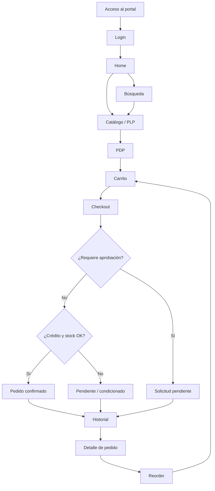

# Storefront Journey - LvlUp WholeSale

## 1. Propósito del Documento

Este documento define el **recorrido funcional y UX** del comprador dentro del
storefront B2B de LvlUp WholeSale. Describe qué hace el comprador en cada etapa,
qué espera y qué riesgos UX existen.

Sirve como base para:

- Diseño UX.
- Configuración de Experience Builder.
- Definición de pantallas.
- Validación de flujos.
- Testing funcional.
- Evaluaciones de agentes de IA.
- Futuras decisiones de arquitectura o customización.

Este documento **no define implementación técnica ni wireframes visuales finales**.
Se alinea con `docs/ux/ux-principles.md` y con los documentos de `docs/business/`,
y aplica el principio rector del proyecto: *Configuration first, customization
only when justified*.

---

## 2. Resumen del Journey Principal

Journey principal de un comprador B2B autenticado:

1. Accede al portal.
2. Inicia sesión.
3. Llega a Home.
4. Navega o busca productos.
5. Visualiza PLP.
6. Entra a PDP.
7. Agrega productos al carrito.
8. Revisa el carrito.
9. Inicia el checkout.
10. Confirma el pedido o genera una solicitud pendiente.
11. Consulta el historial de pedidos.
12. Puede realizar un reorder.

| Etapa | Objetivo del comprador | Pantalla principal | Resultado esperado | Riesgo UX |
| --- | --- | --- | --- | --- |
| Acceso y login | Entrar de forma segura | Login | Sesión iniciada con su contexto de cuenta | Errores de login confusos |
| Home | Orientarse y elegir camino | Home | Acceso rápido a catálogo, búsqueda, carrito e historial | Home demasiado B2C o sobrecargada |
| Navegación de catálogo | Explorar categorías | Catálogo / PLP | Llegar a productos visibles para su cuenta | Mostrar productos no permitidos |
| Búsqueda | Localizar productos rápido | Resultados / PLP | Resultados relevantes y visibles | Resultados sin feedback útil |
| PLP | Comparar y decidir | PLP | Ver precio y disponibilidad para decidir | Saturación visual o falta de precio/stock |
| PDP | Validar el producto | PDP | Información suficiente y añadir al carrito | Inconsistencia de precio respecto a PLP |
| Agregar al carrito | Seleccionar y reservar intención | PDP / PLP | Producto añadido con feedback claro | Añadir sin validar stock/visibilidad |
| Carrito | Revisar antes de comprar | Carrito | Líneas, importes y restricciones claras | Sorpresas de precio o restricciones ocultas |
| Checkout | Confirmar la compra | Checkout | Pedido confirmado o derivado a aprobación | Creer que está confirmado cuando está pendiente |
| Confirmación / pendiente | Saber qué pasó | Confirmación | Estado inequívoco del pedido | Confundir pendiente con éxito final |
| Historial | Trazar pedidos | Historial de Pedidos | Listado claro con estado e importe | No poder distinguir estados |
| Detalle de pedido | Revisar un pedido | Detalle de Pedido | Detalle completo y acceso a reorder | Detalle incompleto |
| Reorder | Repetir compra | Carrito (desde pedido) | Productos válidos al carrito, cambios informados | Reorder con datos obsoletos |

---

## 3. Principios del Journey

- El journey debe ser **claro y directo**.
- El comprador debe **saber siempre dónde está**.
- El comprador debe **entender precios, stock, restricciones y estados**.
- El journey debe soportar **compra nueva y compra recurrente**.
- El journey debe **minimizar la fricción**.
- El journey debe funcionar en **desktop y mobile**.
- El journey debe apoyarse en **estándar de Salesforce B2B Commerce** antes que en
  UI custom.

---

## 4. Etapa 1: Acceso al Portal

- **Objetivo del comprador.** Entrar de forma segura para acceder a su experiencia
  B2B personalizada.
- **Punto de entrada.** URL del storefront / pantalla de Login.
- **Información esperada.** Campos de acceso claros y recuperación de contraseña
  visible.
- **Resultado esperado.** Sesión iniciada con el contexto de cuenta y Buyer Group
  cargado.
- **Riesgos UX.** Mensajes de error ambiguos; no indicar cómo recuperar acceso.
- **Estados posibles.**
  - Acceso correcto.
  - Sesión expirada.
  - Usuario no autenticado.
  - Error de login.
- **Consideraciones mobile-first.** Formulario simple, botones accesibles, teclado
  adecuado en campos.
- **Relación con reglas de negocio.** BR-ACCESS-001, BR-ACCESS-002, BR-ACCESS-003,
  BR-ACCESS-004, BR-ACCESS-005.

---

## 5. Etapa 2: Home

- **Objetivo de la Home.** Orientar al comprador y darle acceso rápido a sus tareas
  habituales.
- **Qué debe permitir hacer.** Llegar al catálogo, buscar, ver el carrito y acceder
  a historial/reorder y a Mi Cuenta.
- **Elementos funcionales recomendados.**
  - Acceso al catálogo.
  - Categorías principales.
  - Búsqueda.
  - Acceso al carrito.
  - Acceso a historial/reorder.
  - Acceso a Mi Cuenta.
- **Qué evitar.**
  - Exceso de contenido promocional B2C.
  - Demasiada carga visual.
  - Navegación confusa.
- **Resultado esperado.** El comprador identifica de inmediato su siguiente acción.
- **Consideraciones mobile-first.** Accesos clave visibles sin scroll excesivo;
  jerarquía simple.

---

## 6. Etapa 3: Navegación de Catálogo

- **Objetivo del comprador.** Explorar el catálogo y localizar la categoría
  adecuada.
- **Cómo debería explorar categorías.** Navegación simple, sin menús excesivamente
  profundos, con rutas claras hacia PLP.
- **Catálogo restringido.** Solo se muestran las categorías y productos permitidos
  para su cuenta/Buyer Group; lo restringido no aparece.
- **Información que necesita.** Categorías comprensibles y orientadas a la compra
  B2B.
- **Relación con Buyer Groups o cuenta.** La visibilidad depende de la cuenta o del
  Buyer Group (PV-001, PV-006).
- **Riesgos UX.** Exponer productos no permitidos; jerarquía de categorías confusa.
- **Resultado esperado.** El comprador llega a una PLP con productos visibles para
  su cuenta.

---

## 7. Etapa 4: Búsqueda de Productos

- **Objetivo.** Localizar productos rápidamente por término.
- **Comportamiento esperado.** Resultados dentro del catálogo visible para la
  cuenta.
- **Estado con resultados.** Listado relevante con acceso a PLP/PDP.
- **Estado sin resultados.** Mensaje claro (empty) con sugerencia de reformular.
- **Estado con productos restringidos.** Los productos no visibles no aparecen en
  los resultados.
- **Consideraciones UX.**
  - Búsqueda clara y accesible.
  - Feedback útil.
  - No mostrar información técnica.
- **Resultado esperado.** El comprador encuentra productos relevantes y visibles.

---

## 8. Etapa 5: Product Listing Page / PLP

- **Objetivo de la PLP.** Permitir comparar y decidir rápido entre productos
  visibles.
- **Información mínima esperada por producto.**
  - Nombre.
  - Imagen o placeholder.
  - Categoría.
  - Precio aplicable.
  - Disponibilidad funcional si aplica.
  - Acción hacia PDP o carrito si el estándar lo permite.
- **Estados.**
  - Lista con productos.
  - Lista vacía.
  - Filtros sin resultados.
  - Productos restringidos no visibles.
- **Consideraciones mobile-first.** Tarjetas legibles, precio y disponibilidad
  visibles, sin saturación.
- **Riesgos UX.** Ocultar precio o stock; sobrecarga visual; inconsistencia con
  PDP.

---

## 9. Etapa 6: Product Detail Page / PDP

- **Objetivo de la PDP.** Dar la información suficiente para decidir y añadir al
  carrito.
- **Información esperada.**
  - Nombre.
  - SKU.
  - Descripción.
  - Categoría.
  - Precio aplicable.
  - Disponibilidad funcional.
  - Cantidad.
  - Acción de agregar al carrito.
- **Estados.**
  - Producto disponible.
  - Producto sin stock suficiente.
  - Producto no visible / no permitido.
  - Producto inactivo.
- **Consideraciones UX.** Precio coherente con la PLP; restricciones comunicadas;
  evitar contenido excesivamente B2C.
- **Resultado esperado.** El comprador decide y, si procede, añade el producto al
  carrito.

---

## 10. Etapa 7: Agregar al Carrito

- **Objetivo.** Trasladar la intención de compra al carrito.
- **Acción esperada.** Añadir el producto con la cantidad seleccionada y recibir
  feedback claro.
- **Validaciones funcionales.**
  - Producto visible.
  - Producto comprable.
  - Cantidad válida.
  - Stock suficiente si aplica.
  - Pricing aplicable.
- **Estados.**
  - Producto agregado correctamente.
  - Cantidad inválida.
  - Stock insuficiente.
  - Producto ya no visible.
- **Feedback UX esperado.** Confirmación breve y clara; mensaje accionable si hay
  problema.
- **Consideraciones mobile-first.** Acción de añadir accesible y con confirmación
  visible sin perder contexto.

---

## 11. Etapa 8: Carrito

- **Objetivo del carrito.** Revisar lo seleccionado antes de comprar.
- **Información esperada.**
  - Productos.
  - Cantidades.
  - Precios.
  - Subtotales.
  - Total funcional.
  - Mensajes de restricción.
- **Acciones esperadas.**
  - Modificar cantidad.
  - Eliminar producto.
  - Continuar comprando.
  - Ir a checkout.
- **Estados.**
  - Carrito vacío.
  - Carrito válido.
  - Carrito con restricciones.
  - Carrito con producto no disponible.
  - Carrito con posible aprobación por importe.
- **Riesgos UX.** Sorpresas de precio; no distinguir productos válidos de los que
  tienen problemas.
- **Resultado esperado.** El comprador llega al checkout con un carrito claro y
  validado.

---

## 12. Etapa 9: Checkout

- **Objetivo del checkout.** Confirmar la compra de forma simple y clara.
- **Qué debe revisar el comprador.** Productos, cantidades e importes antes de
  confirmar.
- **Comportamiento esperado.**
  - Revisión del pedido.
  - Validación funcional.
  - Confirmación directa o derivación a aprobación.
- **Estados.**
  - Pedido confirmable.
  - Pedido requiere aprobación.
  - Crédito bloqueado o excedido.
  - Stock insuficiente.
  - Error funcional.
- **Fuera de alcance.**
  - Pagos reales.
  - Tax real.
  - Shipping real.
- **Consideraciones UX.** Mínima fricción; mensajes claros cuando aplique
  aprobación, crédito o stock.
- **Resultado esperado.** Pedido confirmado o solicitud pendiente, con estado
  inequívoco.

---

## 13. Etapa 10: Confirmación o Estado Pendiente

- **Diferencia clave.** Un **pedido confirmado** queda registrado y firme; una
  **solicitud pendiente** (aprobación o cotización) **no** es una confirmación.
- **Mensaje para pedido confirmado.** Confirmación clara con referencia del pedido.
- **Mensaje para aprobación pendiente.** Indicar que el pedido está pendiente de
  aprobación y no confirmado.
- **Mensaje para cotización pendiente.** Indicar que es una solicitud de cotización,
  no un pedido.
- **Riesgo de confusión.** Que el comprador crea que compró cuando el pedido está
  pendiente.
- **Acciones siguientes.**
  - Ver pedido.
  - Volver al catálogo.
  - Consultar historial.
  - Esperar aprobación.
- **Consideraciones mobile-first.** Estado destacado y legible; acción siguiente
  evidente.

---

## 14. Etapa 11: Historial de Pedidos

- **Objetivo.** Dar trazabilidad de los pedidos del comprador.
- **Información esperada.**
  - Listado de pedidos.
  - Fecha.
  - Estado.
  - Importe.
  - Acceso al detalle.
- **Estados.**
  - Con pedidos.
  - Sin pedidos (empty).
  - Error al cargar.
- **Relación con trazabilidad.** Reduce la dependencia del representante de ventas
  (BR-HISTORY-004).
- **Relación con reorder.** El historial es el punto de entrada al reorder.
- **Consideraciones UX.** Estados de pedido visibles y comprensibles; listado
  legible en mobile.

---

## 15. Etapa 12: Detalle de Pedido

- **Objetivo.** Permitir revisar un pedido concreto.
- **Información esperada.**
  - Productos.
  - Cantidades.
  - Precios.
  - Estado.
  - Fecha.
  - Total funcional.
- **Acciones posibles.**
  - Iniciar reorder.
  - Volver al historial.
- **Estados.**
  - Pedido confirmado.
  - Pedido pendiente.
  - Pedido no disponible.
- **Consideraciones UX.** Detalle legible; acción de reorder accesible.

---

## 16. Etapa 13: Reorder

- **Objetivo.** Repetir una compra anterior reduciendo pasos.
- **Flujo esperado.**
  1. El comprador accede a un pedido anterior.
  2. Selecciona reorder.
  3. El sistema valida la visibilidad actual.
  4. El sistema valida el pricing actual.
  5. El sistema valida la disponibilidad funcional.
  6. Los productos válidos pasan al carrito.
  7. Los productos no válidos se informan claramente.
- **Estados.**
  - Reorder completo.
  - Reorder parcial.
  - Productos no disponibles.
  - Pricing actualizado.
  - Productos ya no visibles.
- **Consideraciones UX.** Resumen claro de qué se añade y qué se excluye; mínima
  fricción.
- **Resultado esperado.** Carrito generado con los productos válidos y cambios
  informados (BR-REORDER-003, PV-007).

---

## 17. Journey Alternativo: Compra con Aprobación

1. El comprador arma un carrito.
2. El importe supera el umbral.
3. El sistema informa que requiere aprobación.
4. El comprador continúa sabiendo que **no es la confirmación final**.
5. La solicitud queda pendiente.
6. El comprador puede consultar el estado.

- **Riesgos UX.** Que el comprador crea que el pedido quedó confirmado.
- **Mensajes esperados.** "Pendiente de aprobación" claramente diferenciado del
  pedido confirmado.
- **Decisiones pendientes.** Umbral exacto; responsable aprobador; nivel de
  automatización.
- **Estado MVP.** Definido a nivel funcional; automatización pendiente
  (BR-APPROVAL-001…006).

---

## 18. Journey Alternativo: Stock Insuficiente

1. El comprador intenta comprar un producto.
2. El sistema identifica stock insuficiente.
3. Se informa claramente.
4. El comprador puede ajustar la cantidad, buscar una alternativa o continuar con
   otros productos.

- **Riesgos UX.** Ocultar el problema hasta el checkout; mensajes técnicos.
- **Decisiones pendientes.**
  - Backorder.
  - Fecha estimada de entrega.
  - Productos alternativos.
- **Estado MVP.** Supuesto (comportamiento exacto por confirmar) (BR-STOCK-003).

---

## 19. Journey Alternativo: Crédito Bloqueado o Excedido

1. El comprador intenta confirmar un pedido.
2. El sistema valida el crédito.
3. El crédito no permite continuar.
4. Se informa el motivo de forma funcional.
5. El pedido queda impedido o condicionado según la regla futura.

- **Riesgos UX.** Mensajes técnicos o motivo poco claro.
- **Decisiones pendientes.** Fuente del dato de crédito; regla exacta de bloqueo;
  mensaje funcional.
- **Estado MVP.** Pendiente de decisión (BR-CREDIT-001…005).

---

## 20. Journey Alternativo: Solicitud de Cotización

1. El comprador identifica una necesidad especial.
2. Solicita una cotización.
3. El sistema registra la solicitud.
4. El comprador recibe feedback claro.
5. La solicitud **no** se trata como pedido confirmado.

- **Riesgos UX.** Confundir la cotización con un pedido confirmado.
- **Decisiones pendientes.** Nivel de automatización; campos requeridos; inclusión
  en el MVP.
- **Estado MVP.** Pendiente de decisión / posible futuro (BR-QUOTE-001…004).

---

## 21. Mapa Textual del Journey

> El diagrama es una representación funcional simplificada del journey, no un mapa
> técnico de navegación ni de configuración de Experience Builder.

---

## 22. Supuestos y Decisiones Pendientes

**Supuestos.**

- El comprador prioriza la rapidez y la claridad.
- El portal se usará tanto en desktop como en mobile.
- El MVP usará componentes estándar siempre que sea posible.
- La UX visual final puede evolucionar después.

**Decisiones pendientes.**

- Umbral de aprobación por importe.
- Reglas y fuente del dato de crédito.
- Comportamiento ante stock insuficiente (backorder, fecha estimada, alternativas).
- Alcance del quote request en el MVP.
- Nivel de filtros en PLP y componentes estándar disponibles por pantalla.

---

## 23. Relación con Otros Documentos

- `PROJECT_CONTEXT.md` define el **contexto general** del proyecto.
- `docs/business/` define **negocio, reglas, flujos, catálogo, pricing y
  visibilidad**.
- `docs/ux/ux-principles.md` define los **principios UX** que rigen este journey.
- Este documento define el **journey funcional y UX** del storefront.
- `docs/ux/plp-pdp-guidelines.md` deberá **profundizar en PLP/PDP**.
- `docs/ux/cart-checkout-experience.md` deberá **profundizar en carrito/checkout**.
- `docs/architecture/` deberá **justificar** cualquier decisión técnica o custom.
- `docs/salesforce/` deberá **documentar** la configuración y las capacidades
  estándar.
- `evals/` podrá usar este journey para **evaluar** las respuestas de los agentes
  UX.
